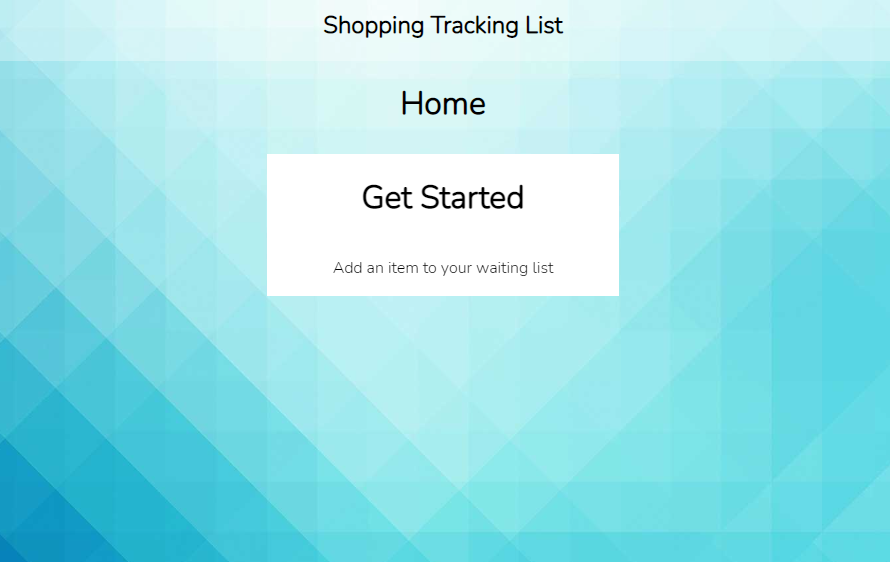
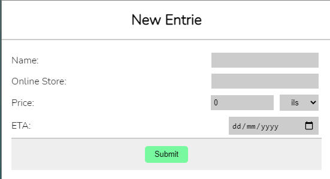
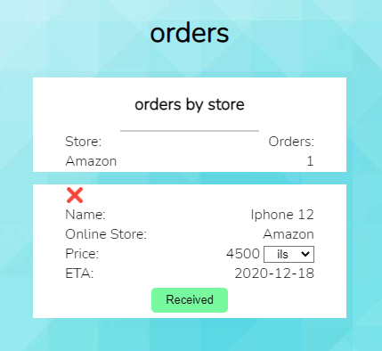
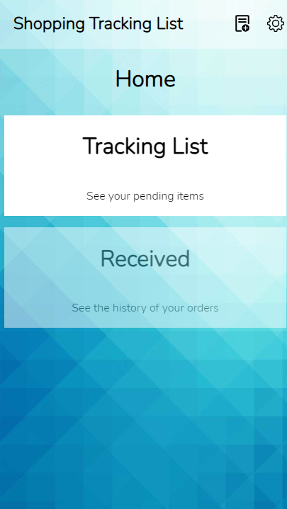
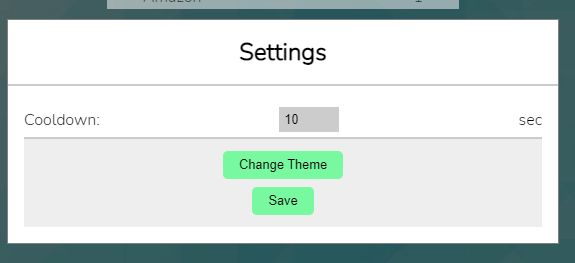
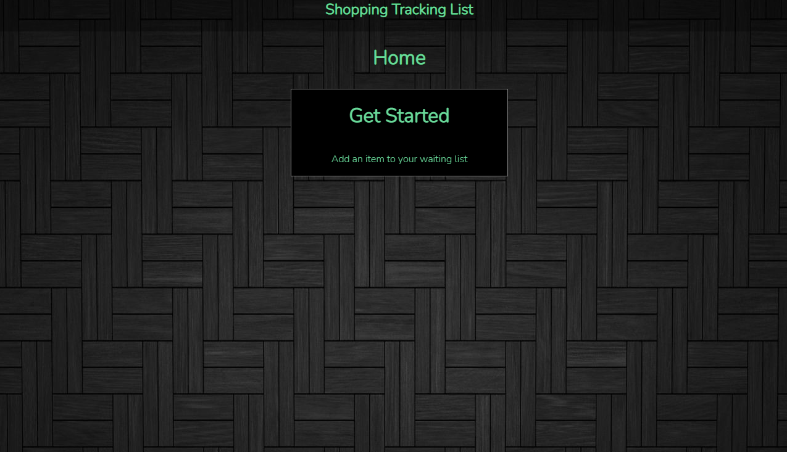

# Omri Zilberstein - Online Shopping Tracker

In this project I created an Online Shopping Tracker. \
I built and designed it myself, without using design repos (Materiaul-UI , etc..). \
The app saves the new data in the apps state, and let the user add / remove / mark as arrived the items. \

The user can choose between dollar to ils, and change it for each item on the go. \
The app is fully responsive and supports phone view aswell. \
 \
The app offers the user the option to change theme and configure the cooldown of the request to the exchange rate API. \

## Deployed

Heroku deployment:
https://limitless-dawn-47857.herokuapp.com/
